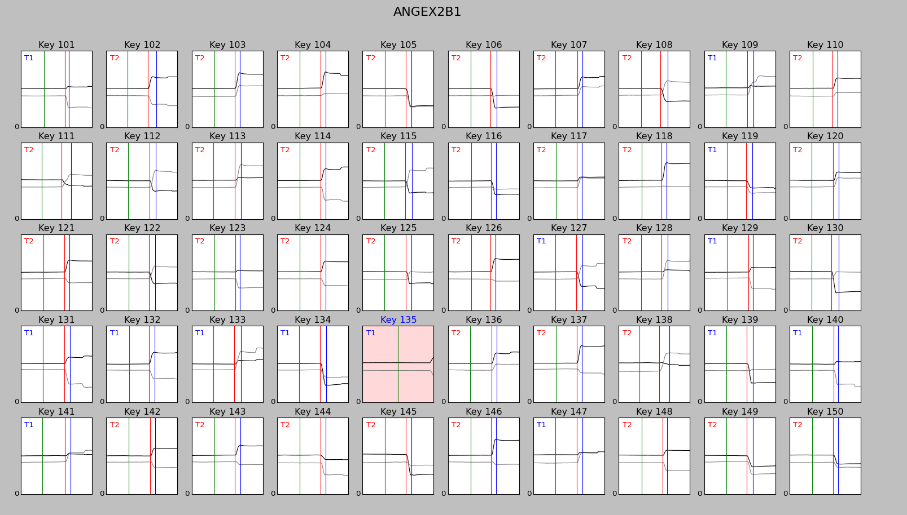

#Readme

## Overview:
This library is done to clean and display eye movements recorded with an EyeTracker. Though the library is generalist, the EDF-to-HDF5 converter is specific to the Eyelink technology and work in tandem with the library ParadigmTools. The two other tools can be used with any recording after they get a little bit formatted.
The library provide the following tools (more details to read in next sections):
* **synchroniseEDFtoHDF5**: it takes EDF files from a source folder, convert them to DataFrames and add them to a unique HDF5 file. It gives the statistics of missing data found at this step.
* **ReadHDF5File**: after your speficy a path to a text editor, it allows you to open the DataFrames inside a HDF5 file. Some other operation are possible such as merging and deleting dataframe.
* **CleaningData**: This program will output an event tables of the saccades onset and offset for a block of trials (i.e. a dataframe). It allows you to visually check out its job and rejected manually trials.

Note that `readHDF5.py` requires you to specify a text editor to open the Dataframes. I recommend to use Vim/gVim, which is really good handling very large file.

Note that `synchroniseEDFtoHDF5.py` requires you to have install edf2asc command line tool from SR Research (Eyelink).

## Formatting of HDF5 file:
This session is especially useful for people who don't use the ParadigmTools and/or an Eyelink.
Each Dataframe in the HDF5 file needs to represent a block of trials. For instance, it can represent the 1600 trials made by the participant AN.

The column names of each dataframe should be the same and should ideally looks like that:

| TRIAL_ID | Fixation0 | Fixation0_DIR | Fixation0_ECC | S11 | S11_DIR | S11_ECC | TRIAL_CODE | TRIAL_TYPE | ps | time | vx | vy | xp | yp |
|----|----|----|----|----|----|----|----|----|----|----|----|----|----|----|
| 1.0 | ON | 0.0 | 0.0 | OFF | 158.0 | 7.0 | 11111.0 | 2.0 | 6125.0 | 0.0 | 65.1 | -26.8 | 447.4 | 648.6 |
|...|...|...|...|...|...|...|...|...|...|...|...|...|...|

Where S1 and Fixation are the user-defined (defined by you) name of Stimuli which are used during the experiment. This nomenclature is actually used by the ParadigmTools library. More details on the nomenclature can be found in that library doc.

Note that the ordering of the columns does not matter and the only mandatory columns are:

| TRIAL_ID | Fixation0 | TRIAL_TYPE | time | vx | vy | xp | yp |
|----|----|----|----|----|----|----|----|
|...|...|...|...|...|...|...|...|

*Fixation0* will be used to defined the first marker in *CleaningData*: the fixation offset, which is usefull to measure reaction time. The name of *Fixation0* can actually be change in the code source. I may improve the code to let the user chose the stimulus offset or event he/she want to use as the first marker.

*Note: You need dataframe names which are meaningful to find them back easily in the HDF5. For example, use a file-name like MGF8TpB2 to specify -- for instance -- Participant MG, Frequence 80%, Target Present, Block 2.*

## Cleaning Data program (details):
It opens the HDF5 file that has been specified in the *currentpath.ph* in the root folder.You can navigate along the dataframes inside the HDF5 file and open one of them to be analyzed.

### Table of Event output:
The program will detect the offset of the fixation, the onset and offset of saccades for each trials and create a table of events. It adds the event table to a new HDF5 file named *name-seq.h5*. The table of event will looks like that:

|TRIAL_ID|TRIAL_TYPE|TRIAL_CODE|time|xp|yp|marker|rejected|
|----|----|----|----|----|----|----|----|
|1.0|2.0|11111.0|1965.0|626.8|523.9|0|False|
|1.0|2.0|11111.0|2176.0|626.2|524.5|1|False|
|1.0|1.0|11211.0|2244.0|330.9|686.7|2|False|
|2.0|1.0|11211.0|1343.0|614.2|536.5|0|False|
|2.0|1.0|11211.0|1540.0|608.1|536.0|1|False|
|2.0|1.0|11211.0|1606.0|507.0|839.5|2|False|
|3.0|2.0|11111.0|1270.0|624.5|527.0|0|False|
|3.0|2.0|11111.0|1485.0|626.1|528.8|1|False|
|3.0|2.0|11111.0|1557.0|578.0|907.7|2|False|

The marker 0 correspond to the offset of the fixation stimulus.

### Check-out Windows and Rejection
After that, the program opens a matplotlib windows which plots the eye positions along time for each trials in the dataframe.

One page contains 50x10 plots (trials): use `D` and `A` to navigate through pages. On each trial, the program marks the fixation offset, the saccade onsets and offsets, for you to check out its job. According to the position of the markers, the program will automatically suspect some trials to be bad trials and color them in a reddish background.

While you are navigating through the trials, you can select a trial by clicking on it and tag it as rejected with the space bar. Once you tagged all the trials you want to tag as rejected, press CTRL + S to save the tags. The columns ["rejected"] is updated.

While you are viewing the trials, note that you can right-click on a plot to enlarge it.

#### Command Summary:
| Command | Description |
|----|----|
| `A` / `D`| Previous/next page
| left-click| select a trial|
| right-click| enlarge the clicked trial|
| `space` | add a rejected tag to the currently selected trial |
|`ctrl` + `T` | add a rejected tag to the trials suspected by the program|
|`alt` + `T` | remove rejected tag to the trials suspected by the program|
| `ctrl` + `S`| save the rejected tag in the event table |
| `T` | toggle trial type display
| `F` | open a 2D plot: x-axis over y-axis, colormap coding the time
| `ctrl` + `n` | open Notepad++ and create a note for this dataframe.

## Notes on the library:

### Faster Saccade Detection:
For now, `DataCleaning.py` is using the `multicleaning` library to clean/analyse data with multi saccades per trial. The `singlecleaning` library was an earlier version which was faster but could only detect one saccade per trial. For now, `singlecleaning` is not usable out-of-the-box: it would need some variable renaming to work again with `DataCleaning.py`.

### Not documented utility functions:
The files filemanager.py and figure.py and util.py contains a lot of useful function for data analysis, such as `util.getDataFrame()` or `util.extractOneSaccadeTraj()` which, respectively, allows to select the dataframe you want to work with in the HDF5 file, and to extract a specific saccade trajectory from each trial. Those functions still need to be documented.
